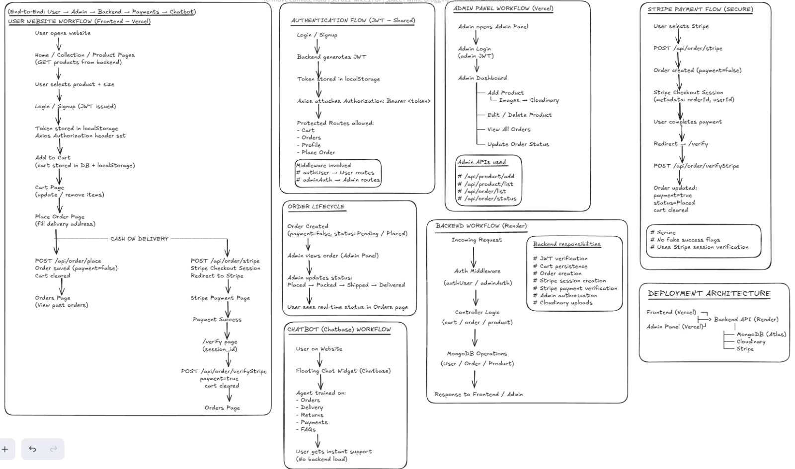

🛒 DailyFit – Full Stack E-Commerce Platform (MERN)

A production-ready e-commerce platform built using the MERN stack, featuring secure authentication, Stripe payments, admin dashboard, cloud image uploads, and AI-powered customer support.

🔗 Live Project Links
- 🛍️ User Website: https://e-com-app-swart.vercel.app
- 🛠️ Admin Panel: https://e-com-app-j53n.vercel.app
- ⚙️ Backend API: https://e-com-app-e2st.onrender.com

📌 Overview

DailyFit is a real-world e-commerce application that allows users to browse products, manage carts, place orders, and make secure payments, while providing admins full control over products and orders.

This project follows industry-standard architecture with:
- Separate User Frontend
- Separate Admin Panel
- Centralized Backend API
- Third-party services (Stripe, Cloudinary, Chatbase)

✨ Features

🧑‍💻 User Features

- Browse products & collections
- Product details with size selection
- User authentication (Login / Signup)
- Persistent cart (DB + local storage)
- Place orders (COD / Stripe)
- Secure Stripe checkout
- View order history & order status
- AI chatbot for instant support

🛠️ Admin Features

- Admin authentication
- Add / edit / delete products
- Upload product images (Cloudinary)
- View all user orders
- Update order status (Placed → Delivered)

🏗️ Tech Stack
Frontend (User + Admin)
- React (Vite)
- Tailwind CSS
- Axios
- React Router
- React Toastify

Backend
- Node.js
- Express.js
- MongoDB (Mongoose)
- JWT Authentication
- Stripe API
- Cloudinary

Other Services
- Stripe – Payments
- Cloudinary – Image hosting
- Chatbase – AI customer support chatbot
- Vercel – Frontend & Admin hosting
- Render – Backend hosting

Website workflow 

🧱 Project Structure
E.com-app/
│
├── frontend/        # User website
├── admin/           # Admin panel
├── backend/         # API server
│   ├── controllers/
│   ├── models/
│   ├── routes/
│   ├── middleware/
│   └── server.js
│
└── README.md

⚙️ Environment Variables
Backend .env
    MONGO_URI=
    JWT_SECRET=
    STRIPE_SECRET_KEY=
    CLOUDINARY_NAME=
    CLOUDINARY_API_KEY=
    CLOUDINARY_API_SECRET=

Frontend / Admin
    VITE_BACKEND_URL=

🚀 Getting Started (Local Setup)
- 1️⃣ Clone Repository
    git clone https://github.com/Akash504-ai/E.com-app.git
    cd E.com-app

- 2️⃣ Backend
    cd backend
    npm install
    npm run server

- 3️⃣ Frontend
    cd frontend
    npm install
    npm run dev

- 4️⃣ Admin Panel
    cd admin
    npm install
    npm run dev

🏆 What This Project Demonstrates
- ✔ Full MERN stack mastery
- ✔ Secure authentication
- ✔ Payment gateway integration
- ✔ Real admin panel
- ✔ Scalable architecture
- ✔ Production deployment
- ✔ Clean code organization

👨‍💻 Author

Akash Santra
🔗 GitHub: https://github.com/Akash504-ai

⭐ Final Note

This project follows real-world software architecture used in production systems.
Feel free to ⭐ the repository or fork it.
